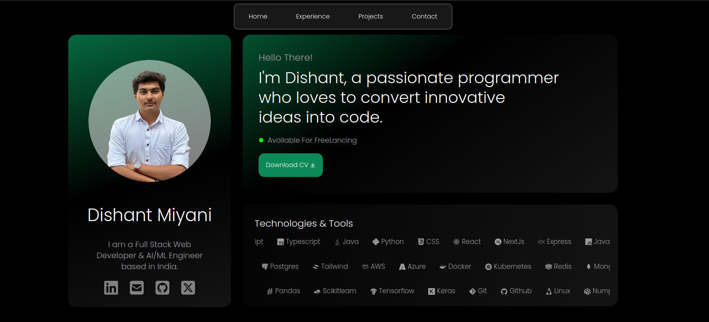

# Dishant Miyani's Portfolio

Welcome to my portfolio repository! This project showcases my work, skills, and accomplishments, providing a platform for others to explore my professional journey and connect with me.

## 🌐 Demo 
    

## 🚀 Features

- **Responsive Design**: The portfolio is fully responsive, ensuring a seamless experience across all devices.
- **Project Showcase**: Highlight of my key projects with detailed descriptions, technologies used, and live demos.
- **Contact Form**: Visitors can reach out to me directly through a contact form integrated into the site.
- **Social Media Links**: Easy access to my social media profiles for networking and collaborations.
- **Smooth Animations**: Subtle animations enhance user experience without compromising performance.

## 🛠️ Technologies Used

- **Frontend**: 
  - [Next.js](https://nextjs.org/)
  - [Tailwind CSS](https://tailwindcss.com/)
  - [TypeScript](https://www.typescriptlang.org/)
  
- **Backend**:
  - [Node.js](https://nodejs.org/)

- **Deployment**:
  - [Vercel](https://vercel.com/)

